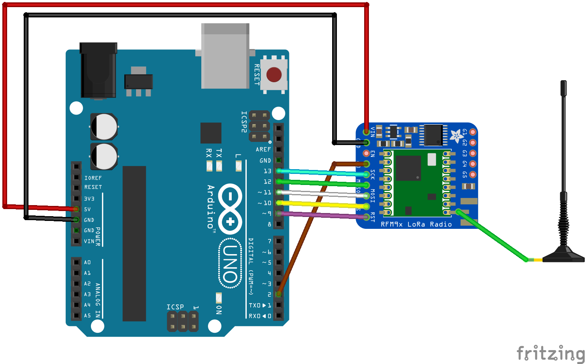
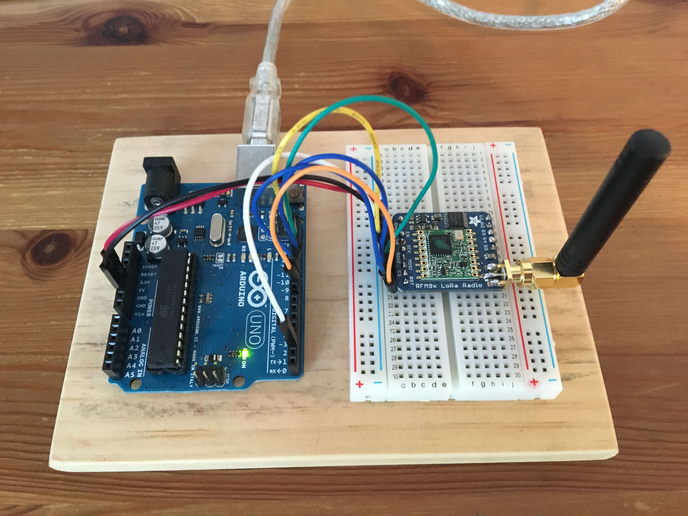
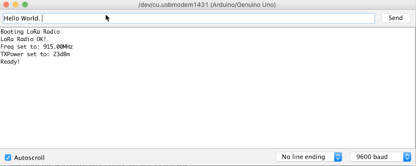

## LoRa Radio Transceiver Project

###Purpose

This project enables two-way radio communication between clients using the Adafruit built [RFM95W LoRa Radio Transceiver Breakout](https://www.adafruit.com/products/3072) and the [RadioHead Packet Radio Library](http://www.airspayce.com/mikem/arduino/RadioHead/index.html).

###Parts List

Aside from the items listed below you'll also need a computer running the Arduino IDE version 1.6.9 or higher. Since this project is a radio communication project you'll need at least two builds in order to communicate (otherwise you're just sending messages into the aether). The approximate cost for a single radio is $70 US (not counting the computer). If you already have the Uno and just need the radio parts the cost is approximately $40 US. Also, you can skip using the SMA connector and quad-band antenna listed below and just use a simple piece of wire if you don't want to spend the money or don't have performance requirements that require the antenna I used for this project.

*	Arduino/Genuino Uno x2
*	RFM95W LoRa Radio Transceiver Breakout x2
*	Edge-Launch SMA Connector for 1.6mm / 0.062" Thick PCBs x2
*	Right-angle Mini GSM/Cellular Quad-Band Antenna - 2dBi SMA Plug x2
*	Half-Size Breadboard x2
*	Jumper Wire and USB Cables

###Deployment

1.	Build *at least* two radios. Thorough instructions are posted on [Adafruit's Tutorial for the RFM9X LoRa](https://learn.adafruit.com/adafruit-rfm69hcw-and-rfm96-rfm95-rfm98-lora-packet-padio-breakouts/overview) page. Note, for the more experienced user a simple wiring diagram is provided below.
2.	If you don't already have the latest Arduino IDE download it from the [Arduino Download Site](https://www.arduino.cc/en/Main/Software) and install on two separate computers.
3.	On both computers, download the [LoRaRadioRXClient.ino](LoRaRadioRXClient/LoRaRadioRXClient.ino) file from this repository.
4.	On both computers, start the Arduino IDE and open the LoRaRadioRXClient.ino sketch.
5.	On both computers edit line 33 and set the OPERATOR to a value that reflects who will sit at each terminal. You may optionally edit lines 31 and 32 to set the operating frequency and transmit power. See Radio Reference Materials in this repository for more information. This author recommends leaving those values set to their defaults. SEE SPECIAL NOTICE BELOW.
6.	If not already done plug both radio assemblies into the USB port of their respective computers.
7.	Load the sketches into each Arduino. The Packet Radios are now ready for use.
8.	Open the Serial Monitor. A message should reflect that the LoRa Radio is ready. If not, check wiring, solder joints, etc.
9.	Type a message into the text field and press enter to transmit. Note, there is very little error handling. The author recommends typing "Over." when the sender is done sending text.
10. Received messages will appear in the Serial Monitor along with the RSSI to reflect the quality of the signal from the remote transmitter.

#####SPECIAL NOTICE

Note that this radio breakout is designed to send on frequencies that are open for use in the US without a license. It is possible, however, to configure the radio to operate in the US Amateur bands. If you are not a licensed US radio amateur operator do not alter the frequency. Also, if you wish to operate outside of the US Adafruit offers radios that transmit on alternate frequencies. See product site for more details.

###Hardware

